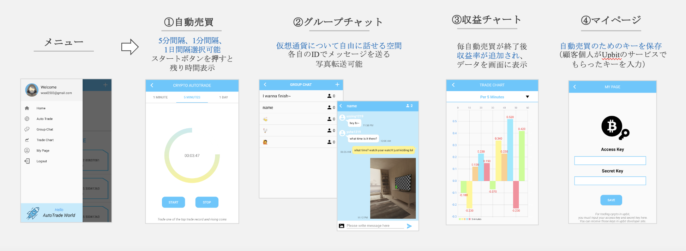
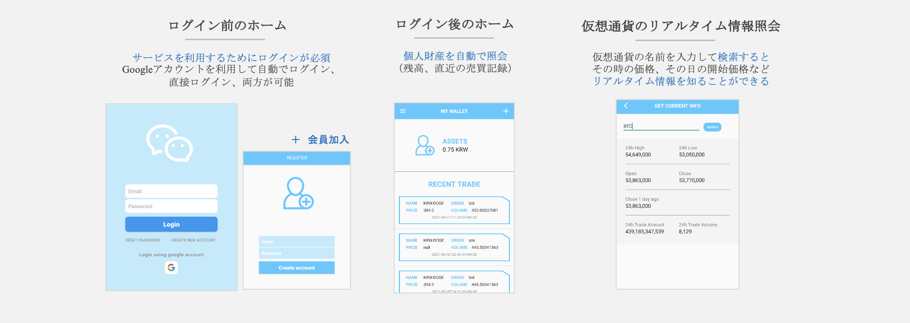
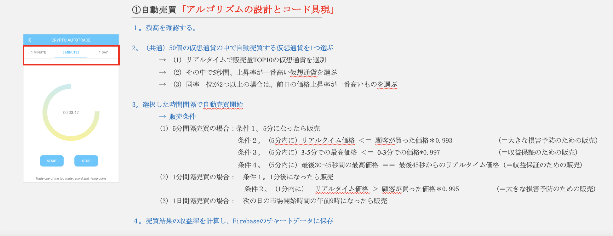
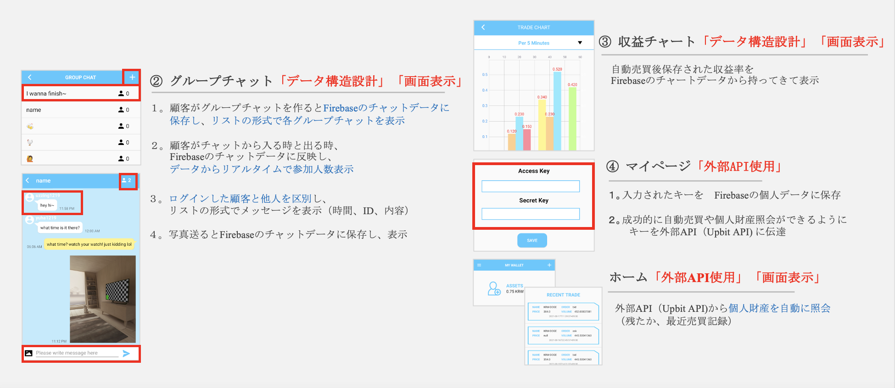

# ACC_AndroidApp
 
<h3>📍「サービス紹介」</h3>
仮想通貨自動売買に特化したAndroidアプリケーション
 
 
<h3>📍「企画背景」</h3>
近年、仮想通貨市場が急激に拡大しているため、素早く判断し、
売買が便利にできるアプリを作りたいと考えた。
 
 
<h3>📍「使用技術」</h3>
DB : Firebase
LANGUAGE : Java
ENVIRONMENT : Android Studio
API : 韓国の代表的な仮想通貨サービスUpbitのAPI
LIBRARY : appcompat, org.json, java-jwt, MPAndroidChartなど
 
 
<h3>📍「開発期間/人数」</h3>
2021年6月14日～2021年8月1日 / 2人
 
 
<h3>📍「機能」</h3>
<ul style="font-size: 25px;">
  <li>ログイン</li> 
  <li>仮想通貨自動売買(5分間隔、1分間隔、1日間隔)</li> 
  <li>収益チャート</li> 
  <li>顧客間対話が自由にできるグループチャット</li> 
  <li>Upbit内の個人財産、直近売買記録の照会</li> 
  <li>仮想通貨のリアルタイム情報照会</li> 
</ul>
<h3>📍「サービスの詳細説明」</h3>

 
<h3>📍「担当した部分」</h3>
「Backend」 80% 「Frontend」 100% 

